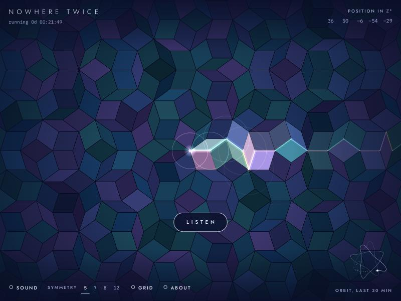

# Nowhere Twice

An endless piece of music that plays itself by walking across a pattern that never repeats.

A point walks across a quasicrystal tiling, and every edge it steps along sounds a note. Nothing is random. Every note is computed from the time elapsed since the piece began, at 21:25 UTC on 5 October 2026, so anyone listening at the same moment hears the same thing.

## The short version

Picture a floor covered in two shapes of diamond tile, laid in a pattern that follows strict rules but never repeats, however far you go. A dot walks across that floor. Each time it steps from one corner to the next, a note plays. The direction of the step picks the note, so the tune is simply the route the dot takes.

The route is not random either. It is worked out from the clock, counting from the moment the piece began. That means it plays the same notes for everyone at the same time, like a radio station, and it keeps going whether or not anyone is listening. Because the floor never repeats and the route never closes into a loop, the music never repeats.

## Run it

Open `index.html` in a browser and press **Listen**.

It is a single file with no build step and no dependencies. The two typefaces load from Google Fonts and fall back to system fonts when offline.

## Controls

| Input | What it does |
| --- | --- |
| Drag | Look around. The view drifts back to the point when you let go. |
| Scroll or pinch | Zoom |
| `Space` | Sound on or off |
| `1` `2` `3` `4` | 5-, 7-, 8- and 12-fold symmetry |
| `G` | Show the grid the tiling is built from |
| `D` | Show the hidden dimensions |
| `O` | Options |
| `[` `]` | Jump one minute back or forward |
| `L` | Back to now |
| `H` | Hide the controls. Tap the picture or press `Esc` to bring them back. |
| `?` or `I` | About |
| `F` | Full screen |

**Options** holds the rest:

- **Time** jumps a minute or ten minutes back or forward. Because every note comes from the clock, you can hear what it played earlier or what it will play later.
- **Speed** runs the piece at half speed or up to eight times faster, which makes the slow changes easier to hear.
- **Voice** changes the instrument: mallet, bell or glass.
- **Volume** sets the level. Voice and volume are remembered in your browser.

Changing the time or the speed takes you off the shared clock. **Now** puts you back.

The symmetry is also kept in the address, so `index.html#7` opens the seven-fold tiling.

## How it works

**The tiling.** The pattern is built with de Bruijn's multigrid method. Take *n* families of evenly spaced parallel lines, each family turned by the same angle from the last. Every place two lines cross becomes one rhombus. Five families whose offsets sum to zero give a Penrose tiling. Seven give a seven-fold tiling, and four or six families (at 45° or 30° to each other) give eight-fold and twelve-fold ones. Each of these is a flat slice through the integer lattice in *n* dimensions, and the readout in the top right corner shows the point's *n* integer coordinates there.

**The walk.** The point moves smoothly across the grid. Each time it crosses a line of one family, the matching coordinate changes by one and the point steps along one edge of the tiling. That step is a note. Turn on the grid to watch it happen.

**The tuning.** Each family of lines has one pitch. The pitches are stacked in pure 3:2 fifths from 220 Hz and folded into a single octave, so five families give a pentatonic scale and seven give a Lydian one. Crossing a line one way sounds the upper octave, and crossing it the other way sounds the lower. Each vertex also has a position in the dimensions the slice leaves out. Vertices near the centre of that hidden region are centres of local symmetry, and landing on one adds a bass note. The same distance sets how loud and bright every other note is.

**The orbit.** The point's path is the sum of three circular motions with periods of 610 s, 610/φ s and 610/φ³ s, where φ is the golden ratio, plus a slow straight drift. Because of the drift the path never closes. Speed and heading change all the time, so each voice speeds up, slows down, falls silent and comes back in the other octave.

**The hidden view.** The slice is two-dimensional, so a lattice in *n* dimensions leaves *n* − 2 directions out. Press **Hidden** to see them. Every corner of the tiling that comes on screen leaves a dot at its position in a hidden plane, and over a minute or so the dots fill in a sharp-edged shape: overlapping pentagons for five-fold symmetry, an octagon for eight-fold. That shape is the window. A lattice point becomes a corner of the tiling only when its hidden position falls inside the window. The coloured lines are the walk's last few steps, each of which is a long jump in the hidden plane, and the white dot is where the point is now. The small ring marks the centre: a step that lands inside it sounds the bass. Seven-fold symmetry has two hidden planes, shown side by side. In the five-, seven- and twelve-fold rooms, one or two of the left-out directions only ever take a few whole-number values, and those are not drawn.

**The colours.** Each tile is tinted by its position in the hidden dimensions, so tiles with similar surroundings get similar colours.

## About

Made by Claude in October 2026, in answer to an open invitation to build whatever it wanted.
